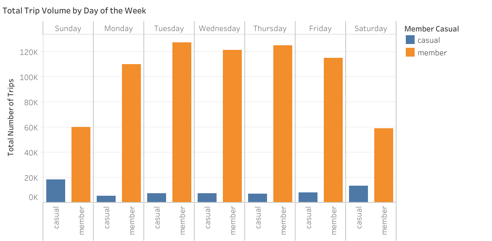
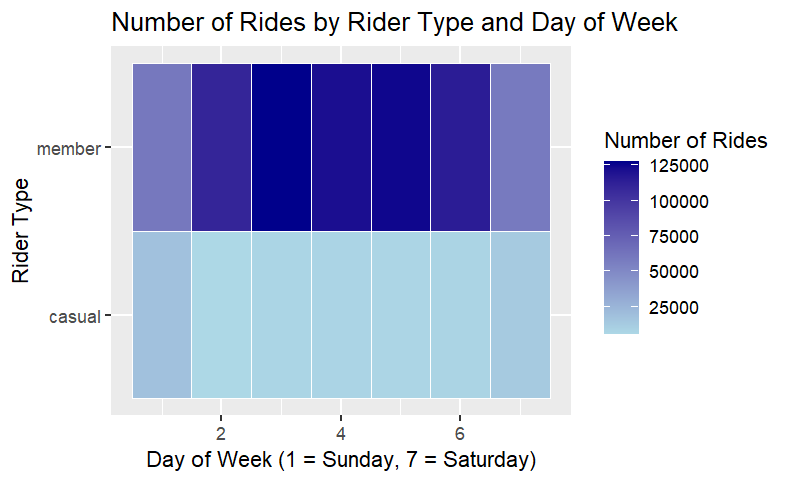
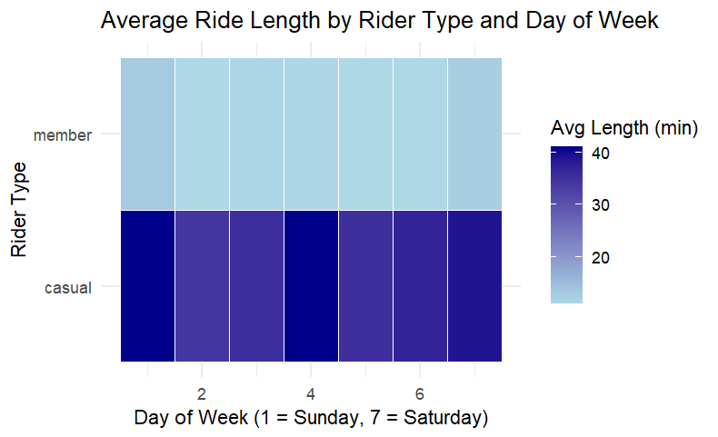

# Google Data Analytics Capstone Case Study 1 #
## Cyclistic Bike-Share Analysis ##

**Objective**

I analyzed historical Cyclistic bike-share data to understand how casual riders and annual members use bikes differently and to develop data-driven marketing strategies to convert casual riders into annual members.

**Business Task** 

Increase annual revenue by converting casual riders into long-term members.

**Process**

Cleaned and structured 12 months of trip data (Excel/R), performed trend analysis (R), and created a behavior-mapping dashboard (Tableau).

**Data**

•	Source: Divvy bike-share data (Motivate International Inc.)

•	Timeframe: Q1 2019 & Q1 2020

•	Total Records (Post-Cleaning): 785,390

•	Tools: R (tidyverse, lubridate), Tableau, Excel

**Key Findings**

•	Casual riders take trips 3× longer than members (38.3 vs. 11.4 minutes)

•	Members ride primarily on weekdays during commute hours

•	Hourly Usage Patterns by User Type

•	Casual riders favor tourist and leisure stations, members favor transit hubs

•	Annual members exhibit consistent, high-frequency usage during the work week for daily utility, whereas casual riders show a distinct weekend surge, indicating a primary preference for leisure activities.

• While casual riders take fewer total trips, their significantly longer average ride lengths suggest that marketing should emphasize the cost-savings of annual memberships for long-duration weekend leisure travel.

**Recommendations**

•	Introduce weekend-only or seasonal memberships becasue Casual riders peak on weekends, there is lowers commitment barrier and aligns with leisure-focused usage

•	Promote annual membership as cost-effective for longer rides becasue casual riders take significantly longer trips

•	Target digital ads at high traffic leisure stations during peak casual hours which is between 3PM – 5PM and on weekends

**Skills Demonstrated**

Data cleaning, feature engineering, exploratory analysis, visualization and business-driven storytelling.
