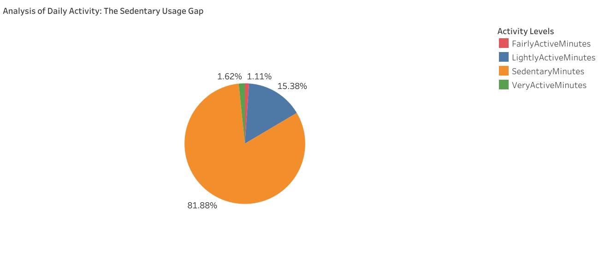
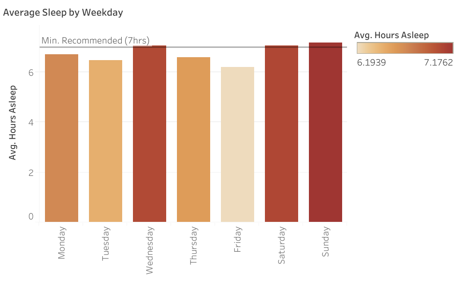
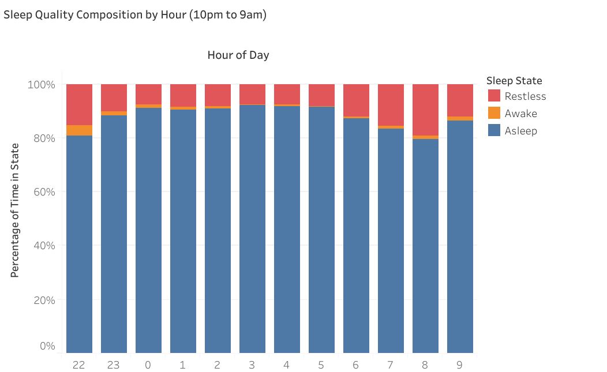
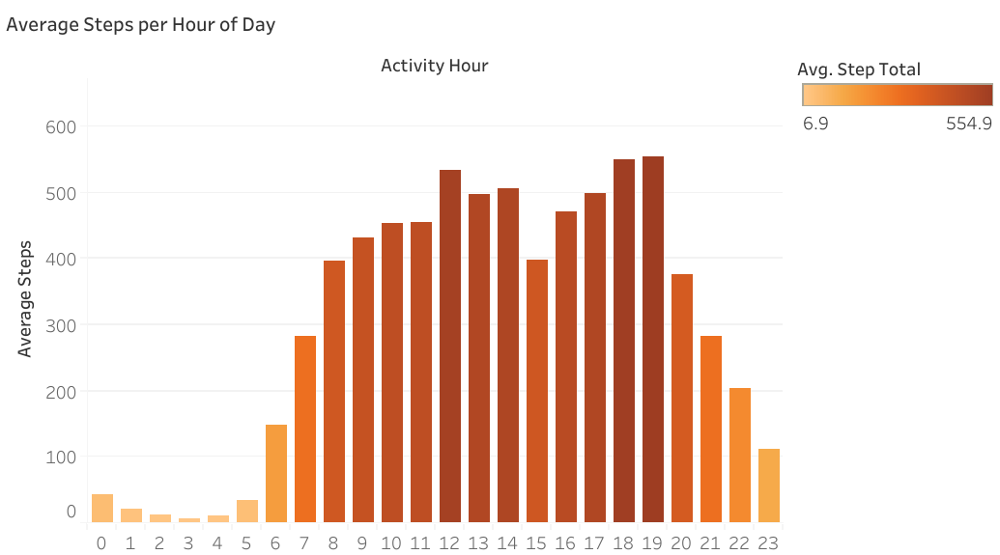
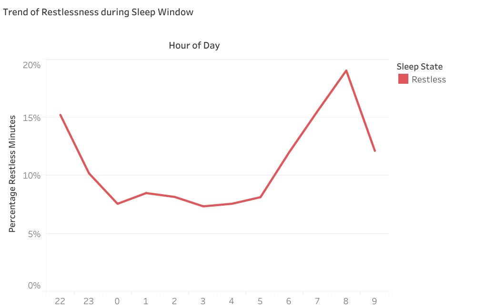
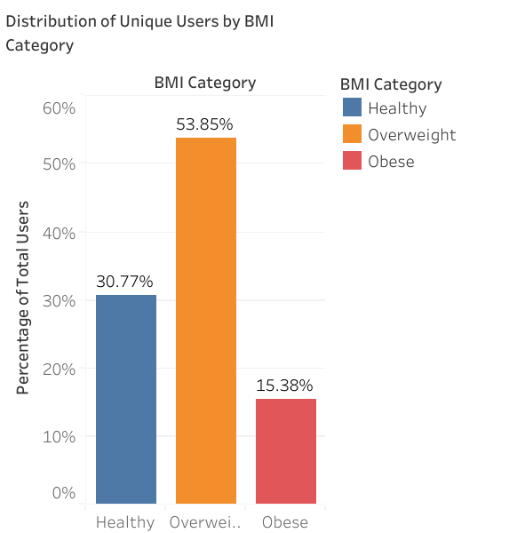
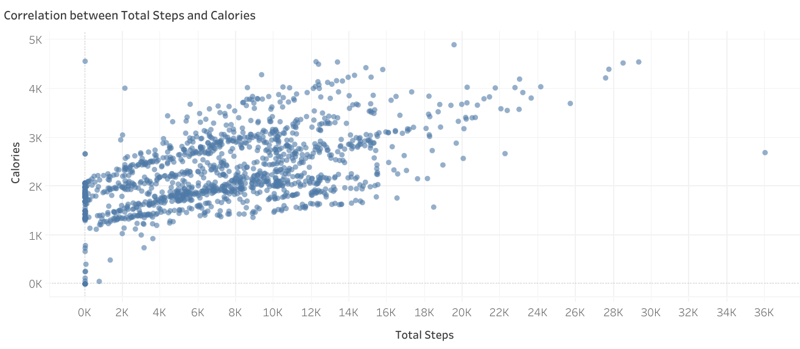

# Bellabeat Wellness Technology Analysis

# Google Data Analytics Capstone Case Study

**Objective**

I analyzed smart device fitness data to unlock new growth opportunities for Bellabeat, a high-tech manufacturer of health-focused products for women. By identifying trends in activity, sleep and weight tracking, I developed data-driven recommendations to enhance Bellabeat’s marketing strategy and membership engagement.

**Data Source**

- Source: Fitabase Data (Public Domain via Kaggle)

- Timeframe: March 2016 – May 2016

- Scope: 30+ users tracking heart rate, sleep and activity.

**Tools Used:**

- SQL (Google BigQuery): Data cleaning, merging multiple datasets (UNION) and feature engineering.

- Tableau: Interactive visualizations and trend discovery.

- Excel: Initial data auditing, pivot table and schema validation.

**Data Processing (SQL)**

- I utilized BigQuery to clean and prepare the dataset for analysis. Key technical steps included:

- Standardizing Timestamps: Created regular expressions to validate date/time formats across disparate tables.

- Deduplication: Used ROW_NUMBER() window functions to partition by Id and Date to ensure only the most accurate records remained.

- Merging Datasets: Combined daily activity, hourly steps and weight logs using LEFT JOIN to create a Master_Hourly_Activity table.

[!TIP] View my full SQL cleaning script here: [Link to your /scripts/bellabeat_queries.sql]

**Key Findings**

1. The Sedentary Reality
My analysis revealed a significant "Sedentary Usage Gap." 81.88% of the average user's day is spent in a sedentary state, with only 1.11% categorized as "Very Active." This highlights a massive opportunity for Bellabeat to introduce "Active Movement" prompts.

2. The Mid-Week Sleep Deficit
Users consistently fall below the 7-hour minimum sleep threshold during the work week, particularly on Fridays. There is a notable recovery trend on weekends where users finally exceed the recommended baseline.

3. Restlessness & Sleep Quality
By analyzing sleep composition by the hour, I identified that restlessness peaks at 8:00 AM, likely coinciding with morning alarms or light-disturbed sleep. Meanwhile, the majority of the time is spent in the Asleep state, particularly from 10 PM to early morning, indicating effective sleep duration.

4. The chart below indicates significant activity peaks around the late morning to early evening hours, particularly between 12:00 PM and 2:00 PM, also between 5:00 PM and 7:00 PM with the highest average step total of approximately 554.9 steps occurring around 5:00 PM.
   

5. Sleep restlessness is highest during sleep onset and wake-up periods, and lowest during the middle of the night, indicating more stable sleep in overnight hours.

6. The majority of users fall within the Overweight (25–29.9) and Obese (30+) categories, with only a small segment maintaining a BMI in the "Healthy" range. This indicates a strong consumer need for personalized health coaching and weight management features within the Bellabeat app to help users transition toward their health goals.

7. There is a clear, positive correlation between Total Steps and Calories Burned. By leveraging this "Proof of Concept," Bellabeat can encourage users to bridge the "Sedentary Gap" by visualizing how small, achievable step goals lead to measurable health results.

**Recommendations**

Based on the data, I recommend the following three-pillar marketing strategy:

- Targeted Sedentary Alerts: Implement smart notifications that recognize when a user has exceeded 60 minutes of sedentary time, encouraging "Micro-Movements."

- Personalized Sleep Hygiene: Leverage the "Mid-Week Deficit" data to push Bellabeat Membership content specifically on Thursday and Friday nights to encourage earlier bedtimes.
  
- Morning Restlessness Coaching: Since restlessness peaks at 8 AM, Bellabeat can offer "Gentle Wake" features or morning meditation content to help users transition from sleep to activity more effectively.

**Skills Demonstrated**
Data cleaning, complex SQL joins, window functions, trend visualization, and translating technical data into business strategy
