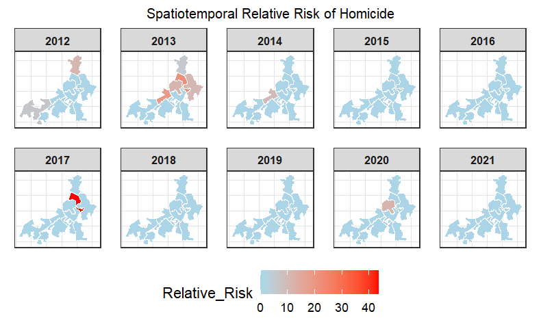
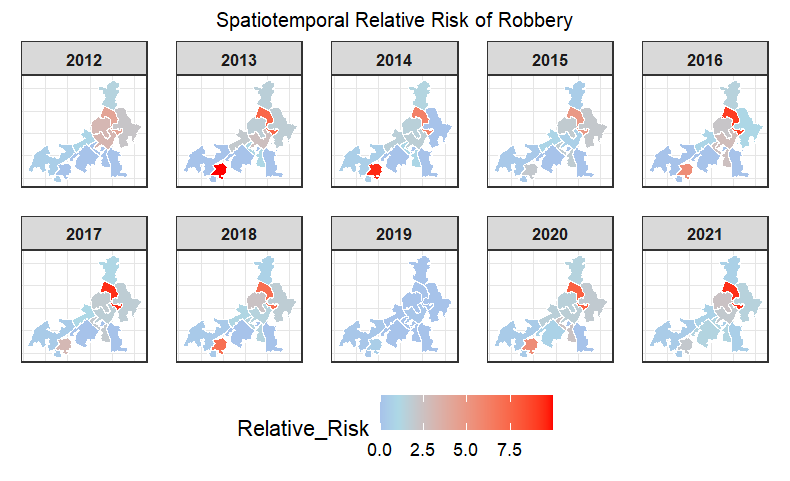
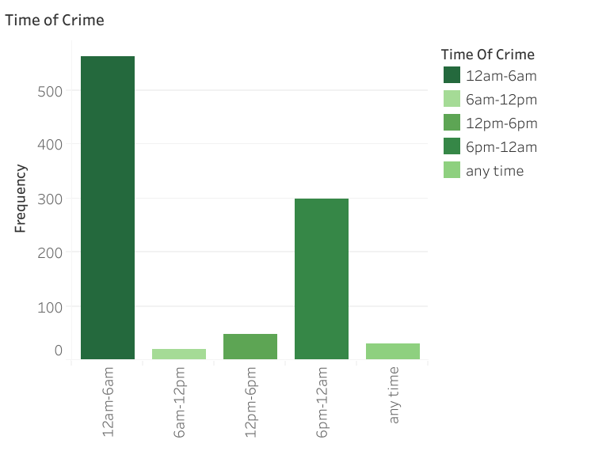
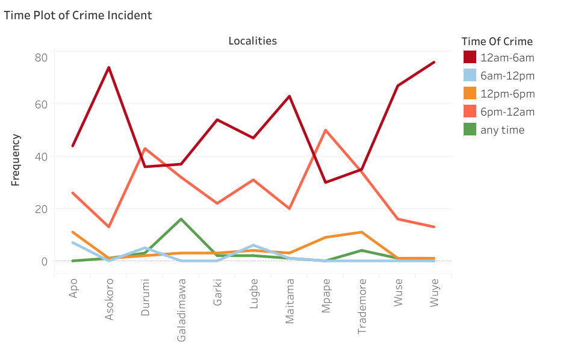
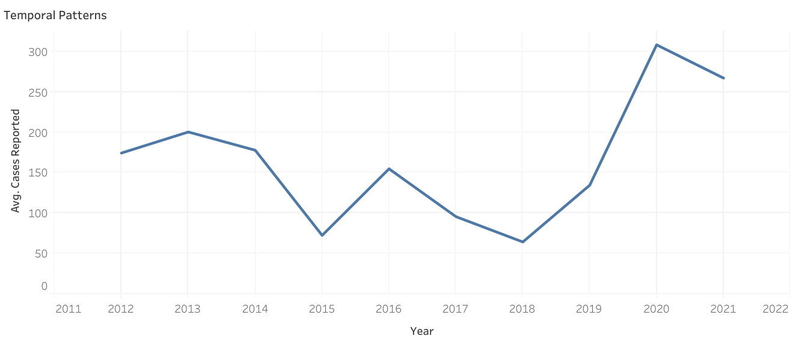
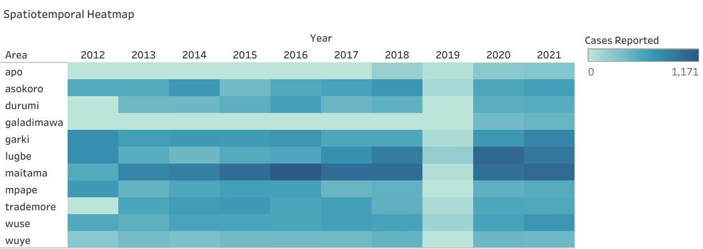
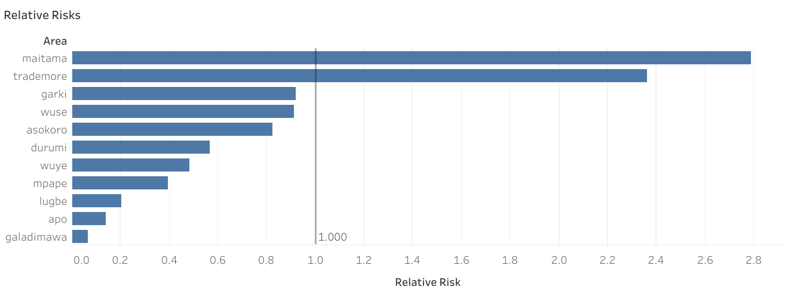

# Bayesian Spatiotemporal Analysis of the Nature and Patterns of Crime Risk in Abuja, Nigeria (2012–2021)

## Project Overview
This project applies **Bayesian Spatiotemporal Modeling** to analyze crime patterns in Abuja, Nigeria, over a 10-year period. Moving beyond traditional descriptive statistics, this study estimates the **Relative Risk (RR)** of Homicide and Robbery incidents across various localities to assist in strategic police resource allocation.

## Key Insights
* **Temporal Hotspots:** Criminal activity peaks significantly between **12:00 AM – 6:00 AM**.
* **High-Risk Localities:** The heatmap reveals a progressive intensification of crime volume across the Federal Capital Territory, peaking in 2021 with 6,707 reported cases, which represents a 70% increase since 2012. Maitama, Lugbe, and Garki emerge as persistent hotspots throughout the decade, while the 2019 data indicates a significant reporting anomaly that was immediately followed by a sharp rebound in criminal activity during 2020
* **Crime Prevalence:** The relative risk map demonstrates a high prevalence of crime in Maitama, Trademark, Garki and Wuse, where the risk of incidents is disproportionately higher than the regional average relative to their population densities.

## Tech Stack & Methodology
* **R Packages:** `sf` (Spatial Data), `tidyverse` (Data Wrangling), `viridis` (Color Scaling), `ggplot2` (Visualization).
* **Preprocessing:** Data cleaning and standardization conducted in Excel prior to Bayesian modeling.
* **Spatial Data:** Shapefile (.shp) and .dbf processing for 11 primary Abuja localities.
* **Analysis:** Relative Risk (RR) calculation using Observed vs. Expected crime counts based on population-weighted global rates.

## Project Structure
* `/data`: Cleaned CSVs (Homicide, Robbery, Spatiotemporal modeling data).
* `/scripts`: R scripts for data joining, RR calculation and faceted mapping.
* `/output`: Spatiotemporal faceted maps showing annual risk evolution.

## Visualizations
### Abuja Crime Intelligence Dashboard (Tableau)
## Objective
To transform complex Bayesian model outputs into an interactive, actionable dashboard for law enforcement agencies and policy makers in the FCT, Abuja.

## [View Interactive Dashboard on Tableau Public](#)

## Features
### 1. Spatiotemporal Relative Risk (Homicide and Robbery)
The faceted maps illustrate how risk intensity shifted from the city center to the suburban fringes over the decade.An interactive grid of Abuja maps allowing users to filter by **Year (2012-2021)** and **Crime Type**. 
* **Functionality:** Uses spatial joins between `.shp` files and cleaned crime CSVs to visualize Relative Risk (RR).
  

### 2. Temporal Analysis (Time of Crime/Time plot of Crime Incidents)
A specialized view showing the frequency of crimes across 6-hour windows.
* **Insight:** Highlights the "Midnight to Dawn" vulnerability window across different localities.

#### Temporal Patterns

### 4. Regional Hotspots - Heatmap
The spatiotemporal heatmap illustrates a progressive surge in Abuja's crime volume over the decade, with Maitama, Lugbe, and Garki consistently identified as the highest-density hotspots for reported incidents

* **Design:** Utilized **Magma** color palettes for high-contrast heatmaps and coordinate grid overlays for geographical context.

## Tableau Workings on Relative Risk
* **Data Modeling:** Implemented a physical join between spatial boundary files and crime datasets on the `LOC_NAME` key.
* **Calculated Fields:** * `Expected Cases`: `{FIXED : SUM([Cases])} / {FIXED : SUM([Population])} * [Population]`
    * `Relative Risk`: `SUM([Cases]) / SUM([Expected Cases])`
      

## Dashboard Preview
https://public.tableau.com/app/profile/olatade.adeoti

## Technical Paper
This analysis is based on the research paper: *“Bayesian Analysis of the Nature and Patterns of Crime Risk in Abuja, Nigeria (2012-2021)”* by Adeoti & Ajibade.
